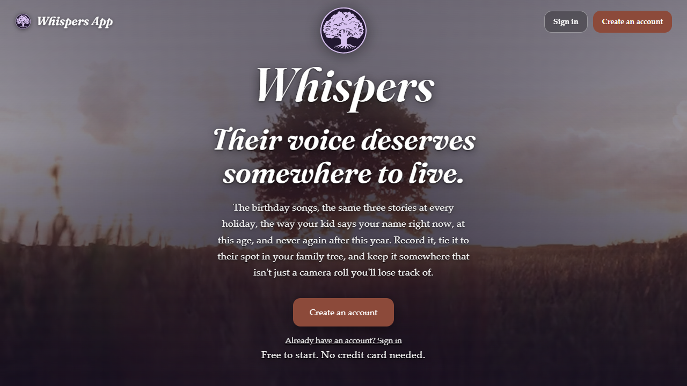
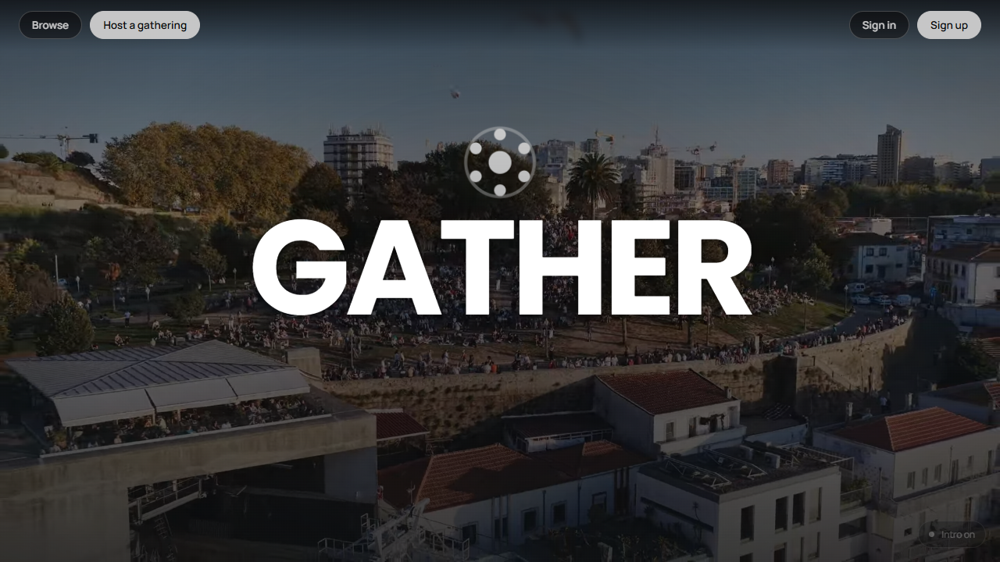

# 👋🏽 I'm Juan!

✨ **Full Stack Jr. Dev** | 🎯 Columbus, OH | 💡 Building interactive, fun, user-centered web applications

---

## 🚀 Currently Upskilling
Expanding my capabilities with industry-standard design and backend tools:

---

## 🏆 Flagship Projects
*The two I'd actually show you first:*

### 🎙️ Whispers App

**[Live demo](https://whispers-app.vercel.app) &nbsp;•&nbsp; [Source code](https://github.com/cohortjuan/Whispers-App)**

A full-stack family voice archive — record and keep the voices of your loved ones, tied to an actual family tree instead of just names on a chart. "Whispers of the ancestors," kept for good.
- 🔐 Real accounts, private per-family trees, and single-use invite codes to bring someone else in
- 🌳 Real connected family tree — parents, spouses, and children drawn as an actual branching diagram, with a show/hide photos toggle
- 🎙️ Recording-first UX, straight from the browser mic, big button front and center
- 🌙 Dark mode with its own regal purple palette, right down to a matching logo variant
- 🐘 React + Vite frontend, Node/Express + PostgreSQL backend, REST API

 

### 🎉 Gather

**[Live demo](https://gather-app-beige.vercel.app)**

A social events app for small gatherings — block parties, potlucks, hobby meetups — built around who's actually showing up, not just who said they would.
- 🤝 Reliability scores derived from real attendance history, not self-reported RSVPs
- 👥 See which of your connections are already going before you commit
- 🎥 A cinematic video-hero intro with a flying-logo animation
- 🐘 React + Vite frontend, Node/Express + PostgreSQL (Prisma) backend, REST API

---

## 🛠️ More Projects
*Click thru my work and code....my mind:*

### 🎨 [Personal Portfolio Site](https://cohortjuan.github.io/)
Lets work!  ...a personal portfolio site with all the fixings **HTML, CSS, and vanilla JavaScript**. 
- 🐍 Canvas-based Snake game with email triggers and game effects
- 🌓 Animated theme toggle...and if you click my name 3 times SUPRISE
- ✨ Smooth, interactive animations, clean but fun

### 🔲 [CSS Layout Lab](https://cohortjuan.github.io/CSSXplorer/)
An interactive **Flexbox and Grid explorer** tool designed to help you master CSS layouts. Fun and simple!
- 🎮 Real-time property updates, se it, believe it...
- 📊 Visual feedback for layout changes, easy peezy
- 🧠 Learn by experimenting or listen to Java, he has your back!

### 📋 [Seedling BOB Habit Tracker](https://cohortjuan.github.io/HabitTracker/)
A gamified habit tracker that turns a few daily habits into an XP system where you level up your digital companion — Seedling Bob. And he is a hoot!
- 🎮 XP system based on habit completion and badges
- 🌱 Animated Seedling Bob with mood states, keep him happy
- 📈 Dynamic level progression system, GRIND
- 🧠 Developer-themed motivational phrases, Bob is a hoot!

---

## 💻 Tech Stack & Tools

**Focus:** Full Stack Web Development • User Experience • Interactive Design

---

## 📬 Let's Connect

---

✨ Crafted with ❤️ and a whole lot of code ✨

